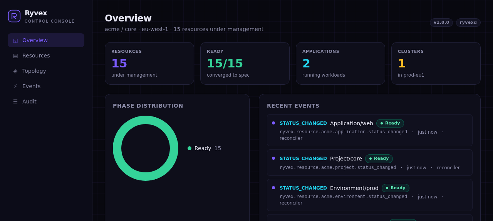
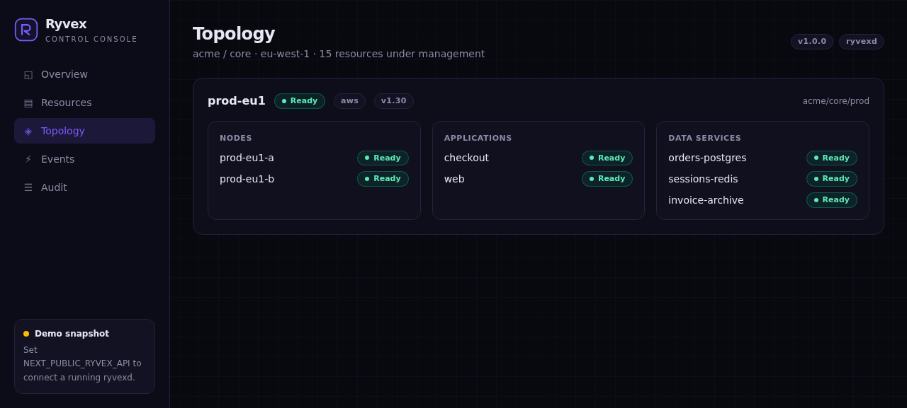

<div align="center">

# Ryvex

### The programmable operating system for infrastructure

**A cloud control plane where infrastructure is declarative state — continuously converged, fully audited, observable in real time.**

[](https://go.dev)
[](https://nextjs.org)
[](https://react.dev)
[](https://www.typescriptlang.org)
[](#verification)
[](#license)

[What is Ryvex?](#what-is-ryvex) · [Quickstart](#quickstart) · [Architecture](#architecture) · [Console](#the-console) · [Roadmap](#roadmap)



</div>

## What is Ryvex?

Modern infrastructure is managed through fragmented, imperative tooling:
scripts, dashboards, and tribal knowledge. Ryvex takes the approach that
conquered container orchestration — **declarative state + continuous
reconciliation + an event-driven core** — and makes it the foundation for
*all* infrastructure: applications, deployments, databases, caches,
buckets, policies, secrets, clusters and nodes.

You declare what the world should look like. Ryvex converges reality to
match, records every change in an immutable audit trail, and publishes
every transition as an event other systems can build on.

Think of it as the control plane layer that sits above your clouds the
way Kubernetes sits above your nodes — but generic, programmable, and
small enough to actually understand end-to-end.

### Design principles

| Principle | In practice |
|-----------|-------------|
| **Declarative first** | Users write `spec`; the reconciler owns `status`. CAS (`generation`) makes concurrent writers safe. |
| **Everything is audited** | Every create/update/delete/status change is attributed to an actor with a reason. |
| **Events are the product** | NATS-style subjects `ryvex.resource.{org}.{kind}.{event}` with `*` / `>` wildcards. |
| **Boring, explicit infra** | Go stdlib HTTP, zero runtime dependencies, clean seams for durable backends. |
| **Frozen wire contracts** | Versioned REST face + error envelope documented in `docs/api-contracts.md`. |

## Quickstart

```bash
git clone https://github.com/Roy-Wanyoike/Ryvex.git
cd Ryvex

# 1. Run the control plane (Go 1.24+)
go run ./cmd/ryvexd serve --http :8080 --dev-auth --seed

# 2. In another terminal — declare a resource
curl -s -X POST localhost:8080/v1/resources \
  -H "Authorization: Bearer ryk_local_dev" \
  -H "Content-Type: application/json" \
  -d '{"kind":"Application","org":"acme","project":"core","env":"prod",
       "name":"payments","spec":{"image":"payments:2.0.1","replicas":3}}'

# 3. Watch the reconciler converge it
curl -s localhost:8080/v1/acme/core/prod/applications/payments \
  -H "Authorization: Bearer ryk_local_dev"

# 4. Launch the web console (Bun or Node 18+)
cd console && bun install && bun run dev   # → http://localhost:3100
```

## Architecture

```
                     ┌───────────────────────────────┐
                     │            ryvexd             │
  ryvex CLI ────────▶│  ┌─────────────────────────┐  │
  Web Console ──────▶│  │      REST API /v1       │  │
  SDKs / CI ────────▶│  │  auth · errors · CORS   │  │
                     │  └───────────┬─────────────┘  │
                     │  ┌───────────▼─────────────┐  │
                     │  │  State Store (+ audit)  │  │
                     │  └───────────┬─────────────┘  │
                     │  ┌───────────▼─────────────┐  │
                     │  │  Event Bus              │  │
                     │  │  ryvex.resource.*       │  │
                     │  └───────────┬─────────────┘  │
                     │  ┌───────────▼─────────────┐  │
                     │  │  Reconciler             │  │
                     │  │  Pending→Provisioning→  │  │
                     │  │  Ready, per generation  │  │
                     │  └─────────────────────────┘  │
                     └───────────────────────────────┘
```

One Go binary, four components, clean interfaces. `state.Store` and
`bus.Bus` are contracts — in-memory today, Postgres/NATS tomorrow,
without touching the API or reconciler. Full write-up in
[`docs/architecture.md`](docs/architecture.md).

## Feature highlights

- **Declarative resource model** — 12 kinds, schema-validated,
  generation-tracked, `spec`/`status` separation
- **Compare-and-swap concurrency** — optimistic locking via
  `generation`, `409 conflict` on stale writers
- **Continuous reconciliation** — scan loop + manual triggers, bounded
  worker pool, observed-generation stamping
- **Immutable audit trail** — who changed what, when, and why
- **Real-time event bus** — subject-based pub/sub with wildcard
  matching and a replay ring
- **Production-grade REST API** — bearer auth, request IDs, frozen
  error envelope, pagination, CORS, graceful shutdown
- **Real-time web console** — five views, live and demo modes,
  dark control-room aesthetic

## The console

| Overview | Topology |
|----------|----------|
|  |  |

The console talks to `ryvexd` over the same public REST API everything
else uses — 15s refresh loop, bearer `ryk_` auth, and a demo snapshot
mode so it renders beautifully even with no daemon running.

## Project layout

```
Ryvex/
├── cmd/
│   ├── ryvexd/          # control plane daemon (serve, seed)
│   └── ryvex/           # operator CLI (apply/get/events/audit/…)
├── internal/
│   ├── state/           # resource model, validation, store backends (memory + Postgres), audit
│   ├── bus/             # event buses (in-memory + NATS JetStream)
│   ├── webhook/         # signed webhook subscriptions with retries
│   ├── authz/           # org/project-scoped RBAC
│   ├── metrics/         # dependency-free Prometheus exposition
│   ├── reconcile/       # convergence loop
│   └── api/             # REST /v1 (routing, auth, handlers)
├── console/             # Next.js 15 web console (read + write)
├── sdk/
│   ├── ryvex-ts/        # TypeScript client (ESM + CJS)
│   └── ryvex-py/        # Python client (stdlib-only runtime)
├── agent/ryvex-agent/   # Rust data-plane node agent
├── docs/
│   ├── architecture.md  # system design
│   ├── api-contracts.md # frozen REST contract
│   ├── metrics.md       # metric families reference
│   └── roadmap.md       # issue-linked feature map
└── go.mod
```

## Verification

Every feature lands with tests and a live smoke check:

```bash
go build ./... && go vet ./... && go test ./...   # control plane + CLI + SDKs' Go surface
RYVEX_TEST_PG_DSN=… go test ./internal/state/...  # Postgres parity suite vs live PG
RYVEX_TEST_NATS_URL=… go test ./internal/bus/...  # NATS JetStream parity suite
cd console && bun run build                        # console: lint + types + build
cd sdk/ryvex-ts && bun test                        # TS SDK suite (28 unit + live integration)
cd sdk/ryvex-py && pytest                          # Python SDK suite (50 unit + live integration)
cd agent/ryvex-agent && cargo test                 # Rust agent suite + clippy -D warnings
```

The repository follows a strict **issue → PR** workflow: no direct
pushes to `main`, every PR closes an issue (`Fixes #N`), and features
merge only when built, tested, and verified end-to-end.

## Roadmap

See [`docs/roadmap.md`](docs/roadmap.md) for the living, issue-linked
map. Highlights on deck: **TypeScript / Python / Go SDKs**, the
**`ryvex` CLI**, **webhook subscriptions**, **durable Postgres state**
and **NATS event streaming**, real **controllers**, **RBAC**, and a
**Rust data-plane agent**.

## License

Apache-2.0 — see [LICENSE](LICENSE).

---

<div align="center">
<sub>Built to be read. Clone it, run it, and see the whole system work on your laptop in under a minute.</sub>
</div>
